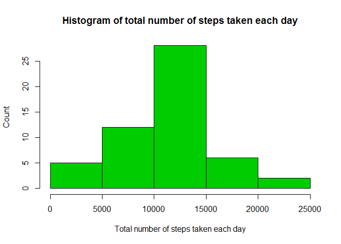
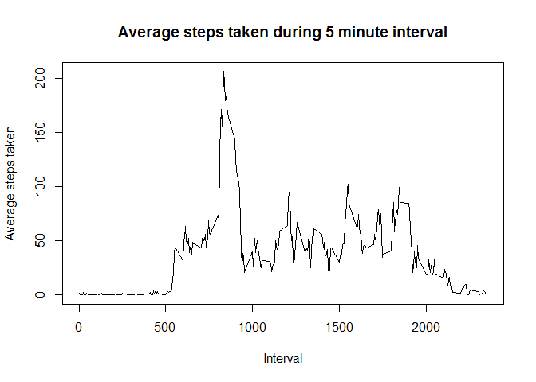
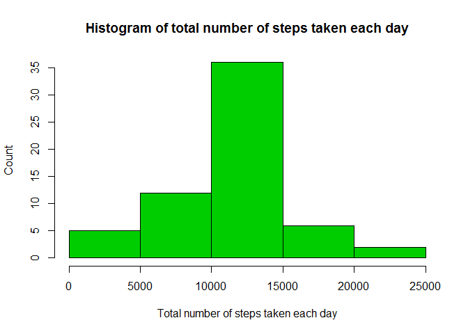
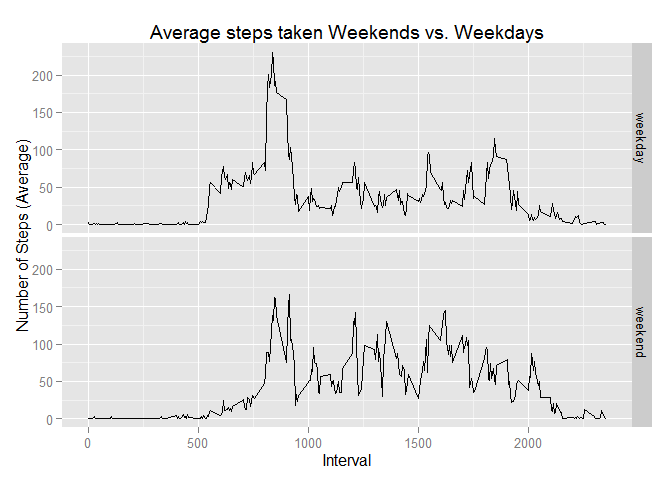

# Reproducible Research: Peer Assessment 1


## Loading and preprocessing the data

I'm also loading the dplyr package because its fast and I think it reads nicely.


```r
# Load dplyr for data summaries later.
library(dplyr)
```

Load the data and then make sure that date converted and stored as a proper date.
I also remove the NAs.

```r
# Unzip and store data, clean up the raw file
activity <- unzip("activity.zip")
rawdata <- read.csv(activity)
rm(activity)

# Convert date variable from factor to date, and remove NAs
data <- na.omit(rawdata)
data$date <- as.Date(data$date)
```


## What is mean total number of steps taken per day?
1. Calculate the total number of steps taken per day
2. Make a histogram of the total number of steps taken each day
3. Calculate and report the mean and median of the total number of steps taken per day

```r
# Group data by date, and summarize the sum of steps
stepsperday <- data %>% 
    group_by(date) %>% 
    summarize(TotalSteps=sum(steps))

# Show histogram of steps per day
hist(stepsperday$TotalSteps, 
     xlab="Total number of steps taken each day", 
     ylab="Count", 
     main="Histogram of total number of steps taken each day",
     col=3)
```

 

```r
meansteps <- mean(stepsperday$TotalSteps)
mediansteps <- median(stepsperday$TotalSteps)
```
**The mean total number of steps per day is 10766.1886792453 and the median is 10765**


## What is the average daily activity pattern?
1. Make a time series plot (i.e. type = "l") of the 5-minute interval (x-axis) and the average number of steps taken, averaged across all days (y-axis)
2. Which 5-minute interval, on average across all the days in the dataset, contains the maximum number of steps?


```r
# Group data by 5 minute interval and summarize the average
# number of steps in that interval
fiveaverage <- data %>%
    group_by(interval) %>%
    summarize(AverageSteps=mean(steps))

# Make an average activity plot
plot(fiveaverage$interval, fiveaverage$AverageSteps, 
     type="l",
     xlab="Interval",
     ylab="Average steps taken",
     main="Average steps taken during 5 minute interval")
```

 

```r
maxstepinterval <- fiveaverage$interval[which.max(fiveaverage$AverageSteps)]
```
**The highest average step count happened during interval 835**


## Imputing missing values
1. Calculate and report the total number of missing values in the dataset (i.e. the total number of rows with NAs)
2. Devise a strategy for filling in all of the missing values in the dataset. The strategy does not need to be sophisticated. For example, you could use the mean/median for that day, or the mean for that 5-minute interval, etc.
3. Create a new dataset that is equal to the original dataset but with the missing data filled in.
4. Make a histogram of the total number of steps taken each day and Calculate and report the mean and median total number of steps taken per day. Do these values differ from the estimates from the first part of the assignment? What is the impact of imputing missing data on the estimates of the total daily number of steps?


```r
# Calculate number of missing values
missing <- sum(is.na(rawdata$steps))
```
**There are 2304 NAs found in the raw data set.**

To fill in the NAs, we will take the average number of steps during that 5 minute interval over all days and assign it to that particular NA.

```r
# Create a filled in dataset by assigning the average value 
# for that time interval if an NA is found.
filldata <- rawdata
for (i in 1:nrow(filldata)) {
    if (is.na(filldata$steps[i])) {
        # Find the index value for when the interval matches the average
        ndx <- which(filldata$interval[i] == fiveaverage$interval)
        # Assign the value to replace the NA
        filldata$steps[i] <- fiveaverage[ndx,]$AverageSteps
    }
}

# Make sure the date variable is still a date.
filldata$date <- as.Date(filldata$date)
```

Plot the new filled data set with a histogram:


```r
# Group data by date, and summarize the sum of steps
fillstepsperday <- filldata %>% 
    group_by(date) %>% 
    summarize(TotalSteps=sum(steps))

# Show histogram of steps per day
hist(fillstepsperday$TotalSteps, 
     xlab="Total number of steps taken each day", 
     ylab="Count", 
     main="Histogram of total number of steps taken each day",
     col=3)
```

 

```r
fillmeansteps <- mean(fillstepsperday$TotalSteps)
fillmediansteps <- median(fillstepsperday$TotalSteps)
```
**The mean total number of steps per day is 10766.1886792453 and the median is 10766.1886792453**  The mean is unchanged, but the median moved slightly and is now equal to the mean.  Inputting missing data based on an average leaves the average daily total number of steps the same while changing the median.

## Are there differences in activity patterns between weekdays and weekends?
1. Create a new factor variable in the dataset with two levels - "weekday" and "weekend" indicating whether a given date is a weekday or weekend day.

2. Make a panel plot containing a time series plot (i.e. type = "l") of the 5-minute interval (x-axis) and the average number of steps taken, averaged across all weekday days or weekend days (y-axis). See the README file in the GitHub repository to see an example of what this plot should look like using simulated data.

Make a variable for the day of the week, and use that to make a "weekend/weeday" variable

```r
# Make weekday variable
filldata$day <- weekdays(filldata$date)
# Define all days as weekdays
filldata$daytype <- "weekday"
# Fix days that are saturday or sunday to be weekends
filldata$daytype[filldata$day %in% c("Saturday", "Sunday")] <- "weekend"
```

Calculate the average weekday steps versus average weekend steps

```r
# Group data by 5 minute interval and summarize the average
# number of steps in that interval
dayaverage <- filldata %>%
    group_by(daytype, interval) %>%
    summarize(AverageSteps=mean(steps))
```

Make a plot of weekdays versus weekends using ggplot2

```r
library(ggplot2)

# Use qplot because facets easily divides the graph into two better than
# the base graphics system.
qplot(interval, AverageSteps, data=dayaverage,
      type="l",
      geom="line",
      xlab="Interval",
      ylab="Number of Steps (Average)",
      main="Average steps taken Weekends vs. Weekdays",
      facets =daytype ~ .)
```

 

There are is earlier activity on weekdays.  I guess people like to sleep in on weekends.
